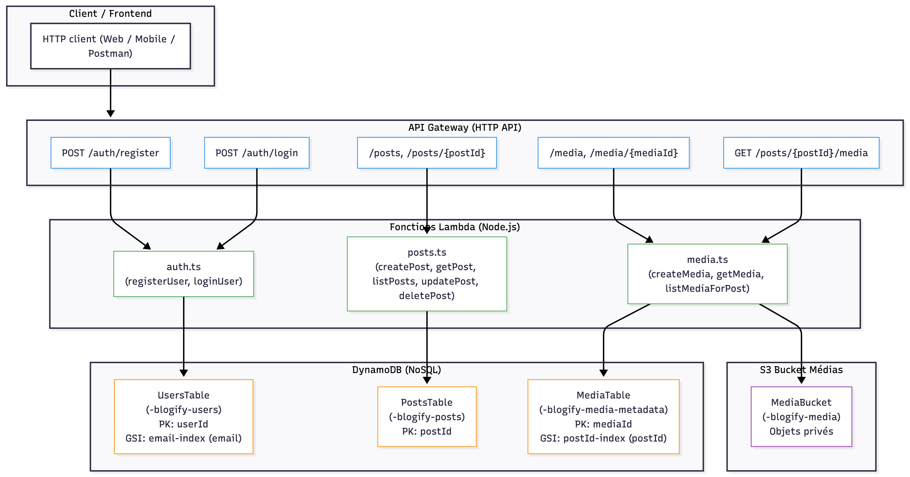

# Blogify – Plateforme de blogging Headless (Serverless)

## Présentation

Blogify est une plateforme de blogging headless entièrement serverless, offrant une API sécurisée permettant :

- l’authentification des utilisateurs (JWT) ;
- la création, modification et suppression d’articles (CRUD) ;
- la gestion des médias (upload via URL pré-signée S3) ;
- l’association d’un média à un article ;
- la recherche textuelle sur les articles ;
- la consultation publique des médias.

Le projet utilise exclusivement des services managés AWS :

- AWS Lambda (Node.js)
- AWS API Gateway (HTTP API)
- AWS DynamoDB (NoSQL)
- AWS S3 (stockage d’objets)
- Serverless Framework

## Architecture générale

Modèle serverless classique fonctionnant entièrement à l’événement :



```
Client HTTP
 │
 ▼
API Gateway (HTTP API)
 │
 ├── /auth/*  → Lambda auth.ts      → DynamoDB (Users)
 ├── /posts/* → Lambda posts.ts     → DynamoDB (Posts)
 └── /media/* → Lambda media.ts
                 ├→ DynamoDB (Media)
                 └→ S3 (upload et accès via URL pré-signée)
```

Tous les accès S3 sont privés.  
Aucun fichier n’est public.  
Le client doit utiliser une URL pré-signée générée par Lambda.

## Structure du projet

```
.
├── src/
│   ├── lambda/
│   │   ├── auth.ts
│   │   ├── posts.ts
│   │   └── media.ts
│   ├── helpers/
│   │   ├── buildJsonResponse.ts
│   │   └── verifyJwt.ts
│   ├── middleware/
│   │   ├── auth/
│   │   │   ├── requireRole.ts
│   │   │   ├── validateLoginPayload.ts
│   │   │   └── validateRegisterPayload.ts
│   │   ├── media/
│   │   │   └── validateMediaPayload.ts
│   │   └── posts/
│   │       ├── validatePostPayload.ts
│   │       └── canModifyPost.ts
│   ├── config/
│   │   ├── s3Clients.ts
│   │   └── dynamoDbClient.ts
│   └── types/
│       ├── userTypes.ts
│       ├── postTypes.ts
│       ├── mediaTypes.ts
│       ├── jwtTypes.ts
│       ├── httpTypes.ts
│       └── validationTypes.ts
│
├── serverless.yml
├── package.json
├── tsconfig.json
└── README.md
```

## Prérequis

Outils nécessaires :

| Outil                | Version                                    |
| -------------------- | ------------------------------------------ |
| Node.js              | 18.x ou supérieur (recommandé : 20.x)      |
| Serverless Framework | `npm install -g serverless`                |
| AWS CLI              | Configuré avec un utilisateur IAM autorisé |

Vérification :

```bash
node -v
sls -v
aws sts get-caller-identity
```

## Installation

Installer les dépendances :

```bash
npm install
```

## Développement local (facultatif)

Serverless peut exécuter vos Lambdas en mode développement :

```bash
serverless dev
```

Ce mode :

- crée une API locale ;
- recharge automatiquement le code à chaque modification ;
- nécessite que les ressources AWS existent déjà (tables, bucket).

## Déploiement sur AWS

### 1. Vérifier les identifiants AWS

```bash
aws sts get-caller-identity
```

### 2. Déployer

```bash
serverless deploy
```

Serverless déploie :

- l’API Gateway HTTP ;
- les fonctions Lambda ;
- les tables DynamoDB (Users, Posts, Media) ;
- le bucket S3 pour les médias ;
- les variables d’environnement.

Les URLs finales sont affichées à la fin du déploiement.

## Documentation API (Swagger)

L’ensemble des endpoints et schémas est documenté dans :

```
swagger.yml
```

Ce fichier peut être importé dans Swagger UI, Postman, Insomnia ou Stoplight.

## Modèles DynamoDB

### Table Utilisateurs

```
PK : userId (S)
GSI : email-index (email)
```

### Table Articles

```
PK : postId (S)
```

### Table Médias

```
PK : mediaId (S)
GSI : postId-index (postId)
```

## Variables d’environnement

Injectées automatiquement par Serverless :

```
USERS_TABLE
POSTS_TABLE
MEDIA_BUCKET
MEDIA_TABLE
JWT_SECRET
```

## Nettoyage

Supprimer toutes les ressources AWS créées :

```bash
serverless remove
```
